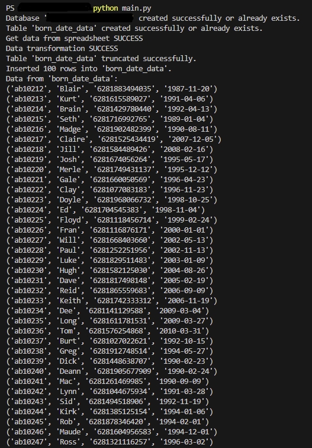

## Getting Started

To get started with this project, follow these steps:

1. Clone the repository.
2. Install any required dependencies or libraries.
3. Execute the main code.
4. Refer to the individual task folders for specific instructions and additional documentation.
5. For any questions or issues, please refer to the contact information provided in the project.

## Folder Structure

1. [read.py](etl/read.py)            : Script to extract data from a spreadsheet google.
2. [transform.py](etl/transform.py)  : Script to transform the data.
3. [load.py](etl/load.py)            : Script to connect to the SQLite3 database and load the data.
4. [main.py](etl/main.py)            : Script to execute main code.

## Folder Structure

1. Extract Data
The read.py script reads data from a spreadsheet google using API.

2. Transform Data
The transform.py script performs data transformation on the extracted data.
The transformations may include:
- Column manipulation or calculation (e.g., data type conversion, computing new values).
- Standardizing formats (e.g., date or phone number formats).

3. Load Data
The load.py script establishes a connection to the SQLite3 database.
The transformed data is loaded into a table in the database.

## Output Load sqlite3 DB

